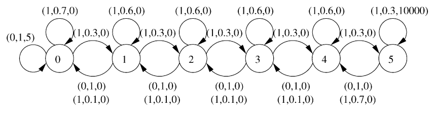

# Expert Guided PAC-Exploration in Model-Based Reinforcement Learning

The project Using an external expert policy to perform more informed and efficient exploration.

The proposal and objectives of this project are described in [this document](https://ishank-juneja.github.io/assets/docs/proposal_PAC_RL.pdf)

The PDF slides for the project for an intermediate presentation made are available on [this link](https://ishank-juneja.github.io/assets/docs/CS748_midterm.pdf).

### Related Projects

Another related project that I have worked on in this space is on [Reward Synthesis](https://github.com/ishank-juneja/reward-search-shaping)

Initial experiments have been run on the River-Swim MDP environment.

   
  

### Instructions to run the scripts

The code is available in the `code` folder.

Instructions Coming soon ... 

### References:

[1] Brafman, R. I. and Tennenholtz, M. R-max - a general polynomial time algorithm for near-optimal reinforcement learning.

[2] Even-Dar, E., Mannor, S., and Mansour, Y. PAC bounds for multi-armed bandit and markov decision
processes. In Kivinen, J. and Sloan, R. H. (eds.), Computational Learning Theory, 15th Annual
Conference on Computational Learning Theory, COLT 2002

[3] Even-Dar, E., Mannor, S., and Mansour, Y. Action elimination and stopping conditions for reinforcement learning. In Fawcett, T. and Mishra, N. (eds.), Machine Learning, Proceedings of the Twentieth International Conference (ICML 2003)

[4] Gupta, A., Mendonca, R., Liu, Y., Abbeel, P., and Levine, S. Meta-reinforcement learning of
structured exploration strategies. In Bengio, S., Wallach, H., Larochelle, H., Grauman, K.,
Cesa-Bianchi, N., and Garnett, R. (eds.), Advances in Neural Information Processing Systems

[5] Hausman, K., Springenberg, J. T., Riedmiller, M., Heess, N., and Wang, Z. Learning an embedding
space for transferable robot skills. 2018.

[6] Kearns, M. J. and Singh, S. P. Near-optimal reinforcement learning in polynominal time. In Shavlik,
J. W. (ed.), Proceedings of the Fifteenth International Conference on Machine Learning (ICML
1998)

[7] Ng, A. Y., Harada, D., and Russell, S. J. Policy invariance under reward transformations: Theory
and application to reward shaping. In Proceedings of the Sixteenth International Conference on
Machine Learning, ICML ’99

[8] Singh, S., Lewis, R. L., and Barto, A. G. Where do rewards come from? In Proceedings of the
Annual Conference of the Cognitive Science Society

[9] Strehl, A. L. and Littman, M. L. A theoretical analysis of model-based interval estimation. In
Proceedings of the 22nd International Conference on Machine Learning, ICML ’05,

[10] Torrey, L. and Shavlik, J. Transfer learning, 2009.